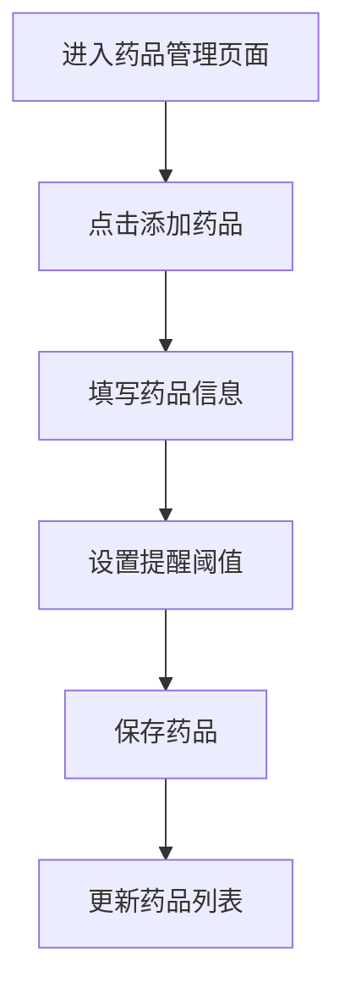
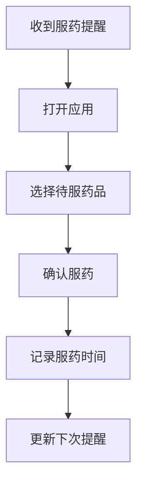

# 电子药箱 - 产品需求文档

## 1. 产品概述

电子药箱是一款家庭健康管理应用，帮助用户管理家庭药品库存、记录服药历史、设置服药提醒提醒，确保用药安全。

- 帮助家庭管理常用药品库存，避免药品过期或短缺
- 记录家庭成员的服药历史，掌握健康状况
- 设置服药提醒，培养良好用药习惯
- 适合有老人、儿童、需要长期服药成员的家庭使用

## 2. 核心功能

### 2.1 用户角色

| 角色 | 注册方式 | 核心权限 |
|------|----------|----------|
| 普通用户 | 邮箱注册/手机号 | 管理自己的药品库、设置提醒、查看服药记录 |

### 2.2 功能模块

1. **药品管理**
   - 添加/编辑/删除药品
   - 药品分类（中药、西药、保健品、外用药等）
   - 库存管理（当前数量、提醒阈值）
   - 药品到期提醒

2. **服药记录**
   - 记录每日服药情况
   - 查看历史服药记录
   - 家庭成员管理

3. **服药提醒**
   - 设置每日/每周服药提醒时间
   - 推送通知提醒服药
   - 标记已服/漏服

4. **健康统计**
   - 服药依从性统计
   - 药品库存预警

## 3. 核心流程

### 3.1 添加药品流程

### 3.2 服药记录流程

## 4. 用户界面设计

### 4.1 设计风格

- **整体风格**：简约现代、温馨亲和，强调安全感和信任感
- **色彩方案**：
  - 主色：#4A90A4（医疗蓝）- 传达专业与信任
  - 辅助色：#7BC9A6（薄荷绿）- 健康、舒适
  - 强调色：#E8846B（珊瑚橙）- 用于提醒和重要操作
  - 背景色：#F8FAFB（淡灰白）
  - 文字色：#2D3748（深灰）
- **按钮风格**：圆角卡片式，柔和阴影
- **字体**：使用思源黑体（Noto Sans CJK）配合干净的无衬线字体
- **布局风格**：底部导航 + 卡片式列表
- **图标**：线性图标，简洁友好

### 4.2 页面设计概览

| 页面名称 | 模块名称 | UI元素描述 |
|----------|----------|------------|
| 首页 | 今日待服 | 显示今日需要服用的药品卡片，醒目的时间提醒 |
| 药品库 | 药品列表 | 分类展示药品，支持搜索，库存状态可视化 |
| 添加药品 | 表单 | 图片上传、分类选择、数量设置、到期日期 |
| 服药记录 | 日历视图 | 日历+列表双视图，历史记录可追溯 |
| 提醒设置 | 时间轴 | 图形化时间轴设置，多时段支持 |
| 我的 | 个人中心 | 家庭成员管理、设置、统计报告 |

### 4.3 响应式设计

- 桌面端：双栏布局，左侧导航 + 右侧内容
- 移动端：单栏布局，底部Tab导航
- 触摸优化：大按钮、高对比度、清晰反馈

## 5. 非功能性需求

- 数据存储在 Neon PostgreSQL 数据库，保证数据安全
- 支持移动端访问，响应式设计
- 提醒通知支持浏览器推送
