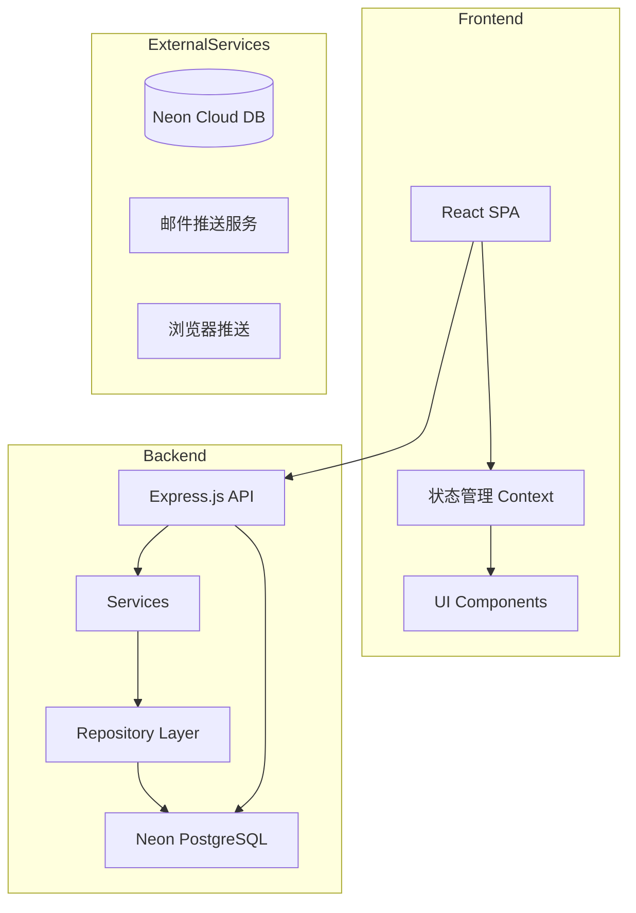
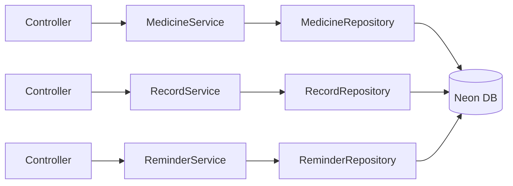
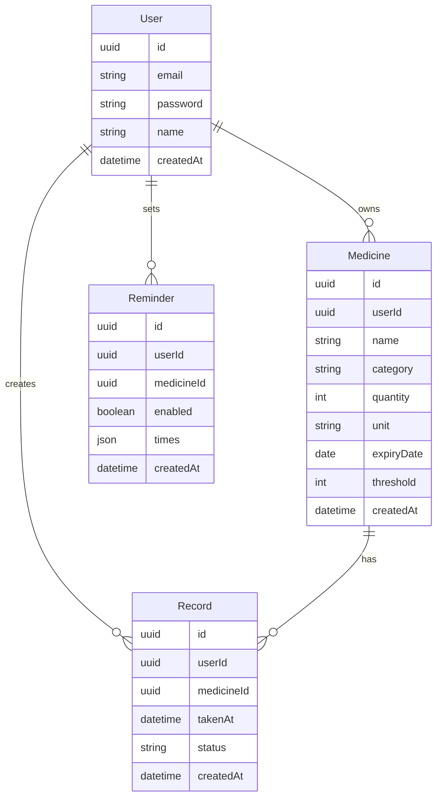

# 电子药箱 - 技术架构文档

## 1. 架构设计



## 2. 技术选型

- **前端框架**：React@18 + Vite
- **样式方案**：Tailwind CSS
- **后端框架**：Express.js@4
- **数据库**：Neon PostgreSQL（Serverless）
- **ORM**：Prisma
- **认证**：JWT Token
- **推送通知**：Web Push API

## 3. 路由定义

| 路由 | 用途 | 认证 |
|------|------|------|
| / | 首页/今日待服 | 需要 |
| /medicines | 药品库管理 | 需要 |
| /medicines/add | 添加药品 | 需要 |
| /medicines/:id | 编辑药品 | 需要 |
| /records | 服药记录 | 需要 |
| /reminders | 提醒设置 | 需要 |
| /stats | 健康统计 | 需要 |
| /profile | 个人中心 | 需要 |
| /login | 登录页 | 否 |
| /register | 注册页 | 否 |

## 4. API 定义

### 4.1 认证接口

```typescript
// POST /api/auth/register
Request: { email: string, password: string, name: string }
Response: { user: User, token: string }

// POST /api/auth/login
Request: { email: string, password: string }
Response: { user: User, token: string }
```

### 4.2 药品接口

```typescript
// GET /api/medicines
Response: { medicines: Medicine[] }

// POST /api/medicines
Request: { name: string, category: string, quantity: number, unit: string, expiryDate: Date, threshold: number, reminderTimes: string[] }
Response: { medicine: Medicine }

// PUT /api/medicines/:id
Request: { name?: string, category?: string, quantity?: number, unit?: string, expiryDate?: Date, threshold?: number, reminderTimes?: string[] }
Response: { medicine: Medicine }

// DELETE /api/medicines/:id
Response: { success: boolean }
```

### 4.3 服药记录接口

```typescript
// POST /api/records
Request: { medicineId: string, takenAt: Date, status: 'taken' | 'missed' }
Response: { record: Record }

// GET /api/records
Query: { startDate?: Date, endDate?: Date }
Response: { records: Record[] }
```

### 4.4 提醒接口

```typescript
// GET /api/reminders
Response: { reminders: Reminder[] }

// PUT /api/reminders/:id
Request: { enabled: boolean, times: string[] }
Response: { reminder: Reminder }
```

## 5. 服务架构



## 6. 数据模型

### 6.1 ER 图



### 6.2 数据定义语言 (DDL)

```sql
-- Users 表
CREATE TABLE users (
    id UUID PRIMARY KEY DEFAULT gen_random_uuid(),
    email VARCHAR(255) UNIQUE NOT NULL,
    password VARCHAR(255) NOT NULL,
    name VARCHAR(100) NOT NULL,
    created_at TIMESTAMP DEFAULT CURRENT_TIMESTAMP
);

-- Medicines 表
CREATE TABLE medicines (
    id UUID PRIMARY KEY DEFAULT gen_random_uuid(),
    user_id UUID REFERENCES users(id) ON DELETE CASCADE,
    name VARCHAR(255) NOT NULL,
    category VARCHAR(50) NOT NULL,
    quantity INTEGER NOT NULL DEFAULT 0,
    unit VARCHAR(20) NOT NULL,
    expiry_date DATE,
    threshold INTEGER NOT NULL DEFAULT 10,
    created_at TIMESTAMP DEFAULT CURRENT_TIMESTAMP
);

-- Records 表
CREATE TABLE records (
    id UUID PRIMARY KEY DEFAULT gen_random_uuid(),
    user_id UUID REFERENCES users(id) ON DELETE CASCADE,
    medicine_id UUID REFERENCES medicines(id) ON DELETE CASCADE,
    taken_at TIMESTAMP NOT NULL,
    status VARCHAR(20) NOT NULL,
    created_at TIMESTAMP DEFAULT CURRENT_TIMESTAMP
);

-- Reminders 表
CREATE TABLE reminders (
    id UUID PRIMARY KEY DEFAULT gen_random_uuid(),
    user_id UUID REFERENCES users(id) ON DELETE CASCADE,
    medicine_id UUID REFERENCES medicines(id) ON DELETE CASCADE,
    enabled BOOLEAN DEFAULT true,
    times JSONB NOT NULL,
    created_at TIMESTAMP DEFAULT CURRENT_TIMESTAMP
);

-- 索引
CREATE INDEX idx_medicines_user ON medicines(user_id);
CREATE INDEX idx_records_user ON records(user_id);
CREATE INDEX idx_records_medicine ON records(medicine_id);
CREATE INDEX idx_reminders_user ON reminders(user_id);
```

## 7. 目录结构

```
/workspace
├── client/                 # React 前端
│   ├── src/
│   │   ├── components/    # 组件
│   │   ├── pages/         # 页面
│   │   ├── context/       # 状态管理
│   │   ├── hooks/         # 自定义 Hooks
│   │   ├── api/           # API 调用
│   │   └── styles/        # 全局样式
│   └── index.html
├── server/                 # Express 后端
│   ├── src/
│   │   ├── controllers/  # 控制器
│   │   ├── services/      # 业务逻辑
│   │   ├── repositories/   # 数据访问
│   │   ├── routes/        # 路由
│   │   ├── middleware/     # 中间件
│   │   └── prisma/        # Prisma 配置
│   └── index.js
├── prisma/
│   └── schema.prisma      # 数据库 Schema
└── package.json
```
